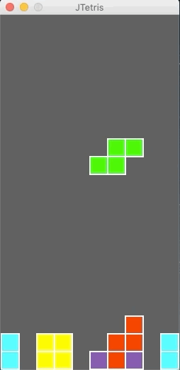

# JTetris

## Tetris Arcade Style
The purpose of this project was to build a simple Tetris arcade style game for all and to utilize Java Graphics APIs, manage and demonstrate proxy and holder design patterns, and strengthen object-oriented programming skills for future personal and professional experiences.  

## Starting the Game
Ensure an updated JDK is installed onto your command line and then download JTetris into an accessible folder onto your computer. There are two ways to run JTetris:

### 1. Console 
#### First, cd into the correct directory where TetrisApp.java and the rest of files are located. After, type the following in the command line:
$ javac TetrisApp.java  
$ java TetrisApp  

Everything should be working! When the game is finished, a message prompt will appear that says "Game over." in which the game will automatically restart for you and will keep doing so unless you close the game, manually.

### 2. IDE/Text Editor/Other Software Programs
Each software program runs java programs differently (e.g for IDEs: Eclipse, IntelliJ, NetBeans, and BlueJ). But provided you follow the user instructions for those specific programs, JTetris will run. I personally used BlueJ to design and build JTetris because of its simplicity, but there are other ways to run the game.

## Controls
*Spacebar*   
* Drop current tetris piece to the bottom of the screen or onto stacked pieces.  
* When game has ended, press to start a new game.  

*Up arrow key*  
* Rotate piece 90º counterclockwise

*Left arrow key*  
* Move piece left.  

*Right arrow key*  
* Move piece right.  

*Down arrow key*  
* Move piece down.  

*P*  
* Pause the game.  

## GamePlay

## Contributers
Augden Shaw  
Tyler T. Nguyen  
Jared D. Nye  
Daniel Scalzi  
UConn Professor Greg Johnson  

